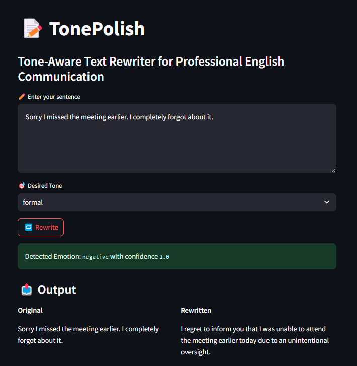
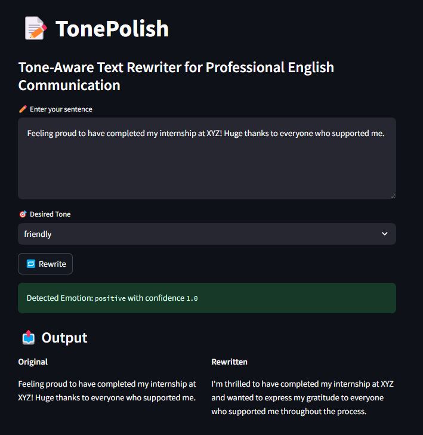

# 📝 TonePolish  
### ✨ Emotion- & Tone-Aware Text Rewriter for Professional English Communication

TonePolish is an NLP-powered web application that helps users rewrite any sentence into a more polished, clear, and professional version — tailored to the tone they choose.

> “Say what you mean. Sound the way you want.”

---

## 🎨 Screenshots

### ✍️ Tone Rewriting



---

## 🧠 Motivation

Writing professionally can be tricky — especially when trying to express emotions like **confidence** without sounding arrogant, or being **friendly** without being too informal. This is even harder for non-native speakers.

**TonePolish** solves that by offering real-time **tone-aware rewriting**, powered by **open-source LLMs**.  
It’s especially helpful for:
- LinkedIn posts
- Job applications
- Cold emails
- Resume tweaks
- General online communication

---

## 🚀 What It Does

1. **Analyzes the emotional tone** of your original sentence (positive, negative, neutral)  
2. **Rewrites** the input sentence in your desired tone:
   - `Friendly`
   - `Confident`
   - `Humble`
   - `Formal`
3. Outputs the **original vs. rewritten text side-by-side**
4. Provides a lightweight UI to experiment and compare tone variations

---

## 🧱 Tech Stack

| Layer              | Details |
|--------------------|---------|
| Frontend (UI)      | [Streamlit](https://streamlit.io/) — for fast, reactive interfaces |
| Backend Logic      | Pure Python (no web server needed) |
| Emotion Detection  | `distilbert-base-uncased-finetuned-sst-2-english` via HuggingFace `pipeline("sentiment-analysis")` |
| Tone Rewriting     | [Nous Hermes 2 - Mistral 7B DPO](https://huggingface.co/NousResearch/Nous-Hermes-2-Mistral-7B-DPO) via HuggingFace Transformers |
| Deployment Ready   | Localhost / Hugging Face Spaces (optional) |
| Token Management   | `.env` with Hugging Face token support (via `python-dotenv`) |

---

## 🧠 How It Works (Under the Hood)

### 1. Emotion Detection (Sentiment Analysis)

- Uses HuggingFace `pipeline("sentiment-analysis")`
- Model: `distilbert-base-uncased-finetuned-sst-2-english`
- Example Output:
  ```json
  {
    "label": "POSITIVE",
    "score": 0.93
  }
  ```

---

### 2. Prompt-Engineered Tone Rewriting

- The app uses a **prompt template** like:

  ```
  Rewrite the following sentence in a [tone] tone for professional communication. [Guide]

  Input: [your text]
  Rewritten:
  ```

- Each tone has its own **embedded guide**, e.g.,  
  `"Be warm, but professional"` or `"Avoid sounding arrogant"`

- Model: **Nous Hermes 2 - Mistral 7B**  
  (fine-tuned via DPO, instruction-following LLM from NousResearch)

---

## 🎯 Use Cases

| Scenario                  | Benefit from TonePolish                                      |
|--------------------------|---------------------------------------------------------------|
| **Job seekers**          | Improve résumé bullet points & professional emails            |
| **Students & interns**   | Write humble yet impressive messages                          |
| **Content creators**     | Hit the right tone for LinkedIn posts (friendly but professional) |
| **ESL speakers**         | Gain clarity and professionalism in non-native English writing |

---

## 🧪 Sample Inputs

Try these in the app with different tone settings:

- `"Can you please send me the final version of the slides when you have time?"`
- `"I think there’s a mistake in the budget numbers you shared."`
- `"Sorry I missed the meeting earlier. I completely forgot about it."`
- `"Feeling proud to have completed my internship at XYZ!"`

---

## 🧰 Dependencies

- `transformers` – HuggingFace models and pipelines  
- `torch` – Backend engine for large language models  
- `streamlit` – UI for real-time interaction  
- `python-dotenv` – Securely load HuggingFace token from `.env`


Install them with:

```bash
pip install -r requirements.txt
```

---

## 🚧 Limitations

- ✅ Currently only supports **English**
- ✅ Works best with **short, single-sentence inputs**
- ⚠️ Very long or abstract inputs may confuse the model
- 🕒 Generation takes ~3–5 seconds on Hermes 2 depending on hardware

---

## 🛠️ Future Ideas

- 🌍 Multilingual support (Spanish, Turkish, etc.)
- 💡 Auto-suggest tone based on detected emotion
- 📄 Paragraph-level rewriting with summarization
- 📈 Rewriting suggestions + brief explanations ("why this is more confident")
- 🔁 Option to compare all tones at once (multi-output view)

---

## 🔒 Security Note

- `.env` file is excluded via `.gitignore`
- Never commit your Hugging Face token to a public repository
- Always use secure tokens with **read-only scope** when possible

---

## 📃 License

This project is open source and available under the **MIT License**.  
(You can replace it with your own license if needed.)

---

## 🙌 Acknowledgments

- 🤗 [Hugging Face Transformers](https://huggingface.co/transformers/)
- 🧠 [Nous Hermes 2 Model](https://huggingface.co/NousResearch/Nous-Hermes-2-Mistral-7B-DPO)
- ⚡ [Streamlit](https://streamlit.io/)
- 📊 [SST-2 Sentiment Model](https://huggingface.co/distilbert-base-uncased-finetuned-sst-2-english)

---

## ⭐️ If You Like This Project

- ⭐ Star this repo  
- 🍴 Fork it and try new tones  
- 🧪 Fine-tune with your own tone dataset  
- 💬 Share your use case with us  

> Let **TonePolish** help you say what you mean — with the tone you intend.

